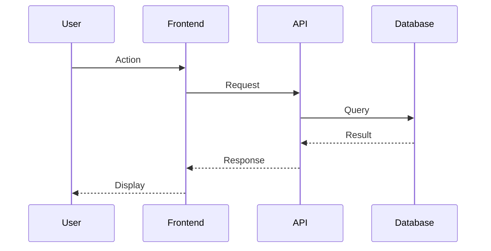
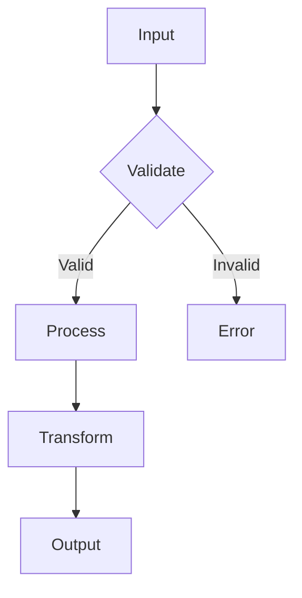
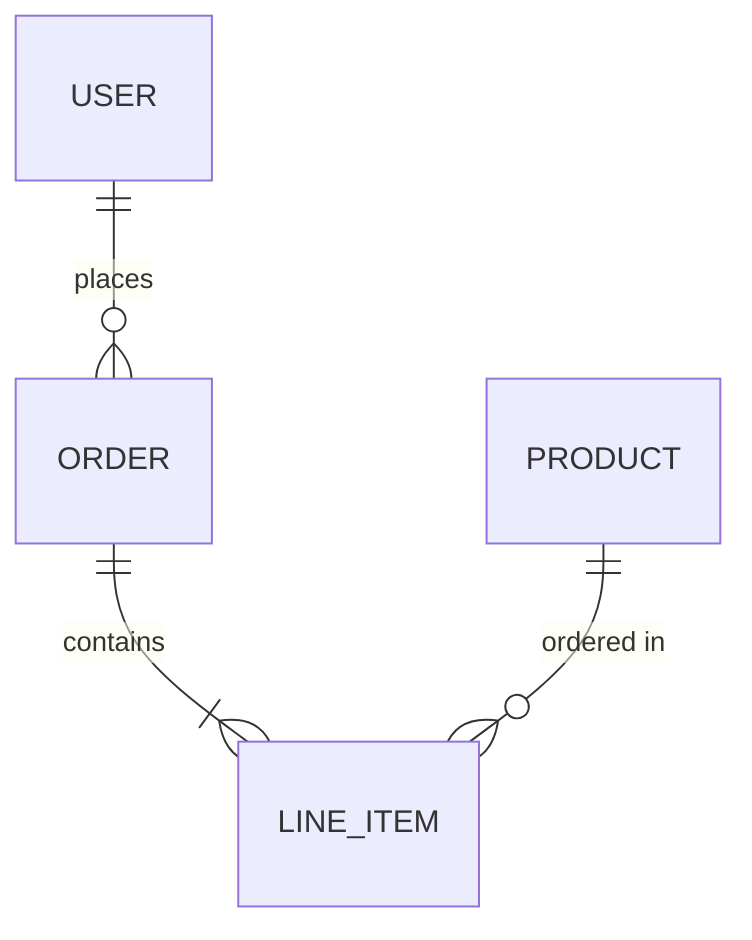
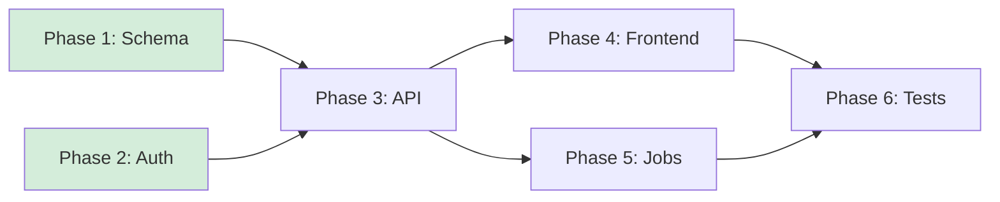

# Plan Skill

**Purpose**: Transform feature descriptions, bug reports, or improvement ideas into well-structured markdown files that follow project conventions and best practices.

## Feature Description

<feature_description> ${ARGUMENTS} </feature_description>

**If the feature description above is empty, ask the user:** "What would you like to plan? Please describe the feature, bug fix, or improvement you have in mind."

Do not proceed until you have a clear feature description from the user.

## Main Tasks

### 1. Repository Research & Context Gathering

<thinking>
First, I need to understand the project's conventions and existing patterns, leveraging all available resources and use parallel subagents to do this.
</thinking>

Run these three agents in parallel at the same time:

- Task repo-research-analyst(feature_description)
- Task best-practices-researcher(feature_description)
- Task framework-docs-researcher(feature_description)

**Reference Collection:**

- [ ] Document all research findings with specific file paths (e.g., `app/services/example_service.rb:42`)
- [ ] Include URLs to external documentation and best practices guides
- [ ] Create a reference list of similar issues or PRs (e.g., `#123`, `#456`)
- [ ] Note any team conventions discovered in `CLAUDE.md` or team documentation

### 2. Issue Planning & Structure

<thinking>
Think like a product manager - what would make this issue clear and actionable? Consider multiple perspectives
</thinking>

**Title & Categorization:**

- [ ] Draft clear, searchable issue title using conventional format (e.g., `feat:`, `fix:`, `docs:`)
- [ ] Determine issue type: enhancement, bug, refactor

**Stakeholder Analysis:**

- [ ] Identify who will be affected by this issue (end users, developers, operations)
- [ ] Consider implementation complexity and required expertise

**Content Planning:**

- [ ] Choose appropriate detail level based on issue complexity and audience
- [ ] List all necessary sections for the chosen template
- [ ] Gather supporting materials (error logs, screenshots, design mockups)
- [ ] Prepare code examples or reproduction steps if applicable, name the mock filenames in the lists

### 3. SpecFlow Analysis

After planning the issue structure, run SpecFlow Analyzer to validate and refine the feature specification:

- Task spec-flow-analyzer(feature_description, research_findings)

**SpecFlow Analyzer Output:**

- [ ] Review SpecFlow analysis results
- [ ] Incorporate any identified gaps or edge cases into the issue
- [ ] Update acceptance criteria based on SpecFlow findings

### 4. Design Visualization (Strongly Recommended)

**Every plan SHOULD include at least one Mermaid diagram** showing the design flow. This helps visualize:
- Input → Processing → Output flow
- Module interactions and boundaries
- Data relationships

Choose the most appropriate diagram type:

#### Sequence Diagram (for interactions/flows)


#### Flowchart (for processing logic)


#### Entity Relationship (for data models)


**Diagram Checklist:**
- [ ] Shows input → processing → output flow
- [ ] Identifies key modules/components involved
- [ ] Highlights integration points or boundaries
- [ ] Uses clear, descriptive labels

**When to use which:**
| Diagram Type | Use When |
|--------------|----------|
| Sequence | API calls, user flows, service interactions |
| Flowchart | Decision logic, data processing, state machines |
| ERD | New models, database changes, entity relationships |
| Class | Object relationships, inheritance, interfaces |

### 5. Parallelization Strategy

Every plan MUST include an **Execution Strategy** section identifying which implementation phases can run concurrently.

**Required elements:**

1. **Mermaid `graph LR` dependency diagram** — nodes = phases, directed edges = "must complete before"; green fill (`style X fill:#d4edda`) = can start immediately with no prerequisites

2. **Phase table**:

| Phase | Name | Depends On | Can Parallelize With | Effort |
|-------|------|------------|----------------------|--------|
| A | Example Phase | — | B | M |
| B | Another Phase | — | A | S |
| C | Third Phase | A, B | — | L |

3. **Inline task tags** within each phase's task list:
   - `[PARALLEL:group-id]` — tasks with the same group-id can run simultaneously
   - `[SERIAL:after-group-id]` — task depends on all tasks in that group completing

**Example:**


### 6. Choose Implementation Detail Level

Select how comprehensive you want the issue to be, simpler is mostly better.

#### 📄 MINIMAL (Quick Issue)

**Best for:** Simple bugs, small improvements, clear features

**Includes:**

- Problem statement or feature description
- Basic acceptance criteria
- Essential context only

**Structure:**

````markdown
[Brief problem/feature description]

## Acceptance Criteria

- [ ] Core requirement 1
- [ ] Core requirement 2

## Context

[Any critical information]

## MVP

### test.rb

```ruby
class Test
  def initialize
    @name = "test"
  end
end
```

## References

- Related issue: #[issue_number]
- Documentation: [relevant_docs_url]
````

#### 📋 MORE (Standard Issue)

**Best for:** Most features, complex bugs, team collaboration

**Includes everything from MINIMAL plus:**

- Detailed background and motivation
- Technical considerations
- Success metrics
- Dependencies and risks
- Basic implementation suggestions

**Structure:**

```markdown
## Overview

[Comprehensive description]

## Background & Motivation

[Why this is needed]

## Technical Considerations

[Architecture, performance, security implications]

## Success Metrics

[How to measure success]

## Dependencies & Risks

[What could go wrong]

## Implementation Suggestions

[High-level approach]

## References

[Links to related work]
```

#### 📚 A LOT (Comprehensive Specification)

**Best for:** Major features, architectural changes, critical bug fixes

**Includes everything from MORE plus:**

- Detailed implementation steps
- API design specifications
- Testing strategy
- Migration plan
- Rollout strategy
- Monitoring requirements

**Structure:**

```markdown
## Executive Summary

[High-level overview]

## Detailed Requirements

[Complete specification]

## API Design

[Endpoints, schemas, examples]

## Implementation Steps

[Phase-by-phase breakdown]

## Testing Strategy

[Unit, integration, E2E tests]

## Migration Plan

[Data migration, backward compatibility]

## Rollout Strategy

[Phased rollout, feature flags]

## Monitoring & Observability

[Metrics, alerts, dashboards]

## References

[All relevant documentation]
```

### 6. AI-Era Considerations

- [ ] Account for accelerated development with AI pair programming
- [ ] Include prompts or instructions that worked well during research
- [ ] Note which AI tools were used for initial exploration (Claude, Copilot, etc.)
- [ ] Emphasize comprehensive testing given rapid implementation
- [ ] Document any AI-generated code that needs human review

### 7. Final Review & Submission

**Pre-submission Checklist:**

- [ ] Title is searchable and descriptive
- [ ] Labels accurately categorize the issue
- [ ] All template sections are complete
- [ ] Links and references are working
- [ ] Acceptance criteria are measurable
- [ ] Add names of files in pseudo code examples and todo lists
- [ ] **Strongly Recommended:** At least one Mermaid diagram showing design flow (sequence, flowchart, or ERD)
- [ ] If no diagram included, add a note explaining why (e.g., "trivial change, no visualization needed")

## Ambiguity Check before Plan Finalization

After the initial plan is generated, but before engaging in general refinement, evaluate the situation against this ambiguity matrix:

| Situation | Action |
|-----------|--------|
| Single valid interpretation | Proceed |
| Multiple interpretations, similar effort | Proceed with reasonable default, note assumption |
| Multiple interpretations, 2x+ effort difference | **MUST ask** |
| Missing critical info (file, error, context) | **MUST ask** |
| User's design seems flawed or suboptimal | **MUST raise concern** before implementing |

If the action requires you to **MUST ask** or **MUST raise concern**, use the **AskUserQuestion** tool immediately to resolve these specific issues before proceeding to the standard refinement phase.

## Output Format

Write the plan to `docs/plans/<feature-name>.md`

Add YAML frontmatter at the top of the plan file:
```yaml
---
stage: plan
created: YYYY-MM-DD
feature: <feature-name>
source-spec: <path to input spec file if input was from docs/specs/, else omit>
status: draft
---
```

If the input was from `docs/specs/`, also update the spec file's frontmatter to add:
```yaml
next-plan: docs/plans/<feature-name>.md
```
Use the Edit tool to append this field inside the existing `---` block without corrupting other fields.

## Refine Plan

After the first Plan is generated, engage in multiple rounds of interaction with the user to Refine the Plan.

NOTE THAT YOU SHOULD USE THE TOOL **AskUserQuestion** TO INTERACT WITH THE USER OR ANY OTHER TOOLS THAT CAN INVOLVE THE USER IN THE PROCESS.

**Interaction Guidelines:**

- When weighing the pros and cons, ask the user explicit questions or solicit their input.
- **Note:** You can ask the user questions or clarify at any time during this workflow. Do not make too many assumptions about the user's intentions.
- Iterate on the plan content in `plans/<issue_title>.md` based on feedback.

Only proceed to **Post-Generation Options** once the user is satisfied with the refined plan.

## Post-Generation Options

After writing the plan file, use the **AskUserQuestion tool** to present these options:

**Question:** "Plan ready at `docs/plans/<feature-name>.md`. What would you like to do next?"

**Options:**
1. **Open plan in editor** - Open the plan file for review
2. **Run `/core:clarify`** - Ask targeted questions to reduce ambiguity in the plan
3. **Run `/core:deepen-plan`** - Enhance each section with parallel research agents (best practices, performance, UI)
4. **Run `/core:plan_review`** - Get feedback from specialized reviewers
5. **Generate ADR** - Capture architectural decisions from this plan as permanent records (`adr`)
6. **Start `/core:work`** - Begin implementing this plan
7. **Simplify** - Reduce detail level

Based on selection:
- **Open plan in editor** → Run `open docs/plans/<feature-name>.md` to open the file in the user's default editor
- **`/core:clarify`** → Call the command with the plan file path to ask targeted clarification questions
- **`/core:deepen-plan`** → Call the command with the plan file path to enhance with research
- **`/core:plan_review`** → Call the command with the plan file path. Spawn reviewers based on project conventions
- **Generate ADR** → Run the `adr` skill with `docs/plans/<feature-name>.md` as input
- **`/core:work`** → Call the command with the plan file path
- **Simplify** → Ask "What should I simplify?" then regenerate simpler version
- **Other** (automatically provided) → Accept free text for rework or specific changes

**Note:** If running `/core:plan` with ultrathink enabled, automatically run `/core:deepen-plan` after plan creation for maximum depth and grounding.

Loop back to options after Simplify or Other changes until user selects `/core:work` or `/core:plan_review`.

NEVER CODE! Just research and write the plan.